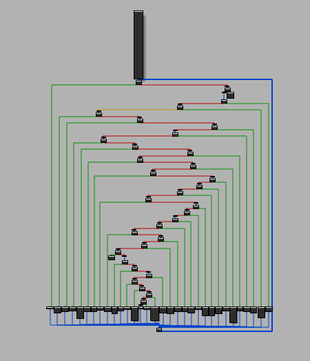
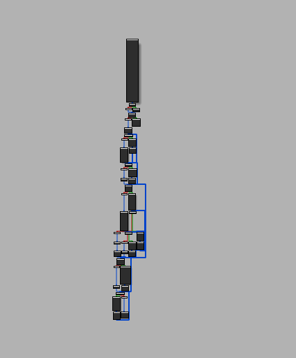

# MODeflattener
***Miasm's Ollvm Deflattener***  
> MODeflattener deobfuscates control flow flattened functions obfuscated by [OLLVM](https://github.com/obfuscator-llvm/obfuscator) using [Miasm](https://github.com/cea-sec/miasm).  
https://mrt4ntr4.github.io/MODeflattener/  

Flattened Flow             |  Deflattened Flow
:-------------------------:|:-------------------------:
  |  

## Installation
```
git clone https://github.com/mrT4ntr4/MODeflattener.git
cd MODeflattener
pip3 install -r requirements.txt
```

## Usage
```
└──╼ $python3 modeflattener.py -h
usage: modeflattener [-h] [-a] [-l LOG] filename patch_filename address

positional arguments:
  filename           file to deobfuscate
  patch_filename     deobfuscated file name
  address            obfuscated function address

optional arguments:
  -h, --help         show this help message and exit
  -a, --all          find functions recursively and deobfuscate if flattened
  -l LOG, --log LOG  logging level (default=INFO)
```

### Supported Architectures
- *x86*

### Bonus
- [Tim Blazytko's flattening heuristic script](https://gist.github.com/mrphrazer/da32217f231e1dd842986f94aa6d9d37)  
  While disassembling the specified function we can look out for other functions used by it and can make use of this script to automatically detect whether it is a flattened one and try to deobfuscate it. This has already been integrated into the tool!    
- [nop-hider idapython script](https://gist.github.com/JusticeRage/795badf81fe59454963a06070d132b06)  
    This script hides the nop instructions from IDA graph view as the backbone is converted into a long nop chain after deobfuscation.  


# References
[Dissecting LLVM Obfuscator - RPISEC](https://rpis.ec/blog/dissection-llvm-obfuscator-p1/)  
[Automated Detection of Control-flow Flattening - Tim Blazytko](https://synthesis.to/2021/03/03/flattening_detection.html)  